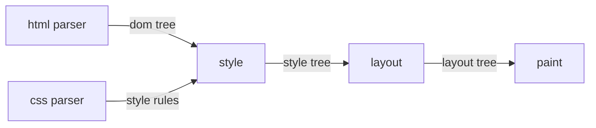

# stephansdom
an educational layout engine, inspired by
[build your own x](https://github.com/codecrafters-io/build-your-own-x).



## installation
you need [bun.sh](https://bun.sh/) installed.

run local dev server:
```sh
bun install
bun run dev
```

also useful:
```sh
bun test
bun run lint
bun run format
```
